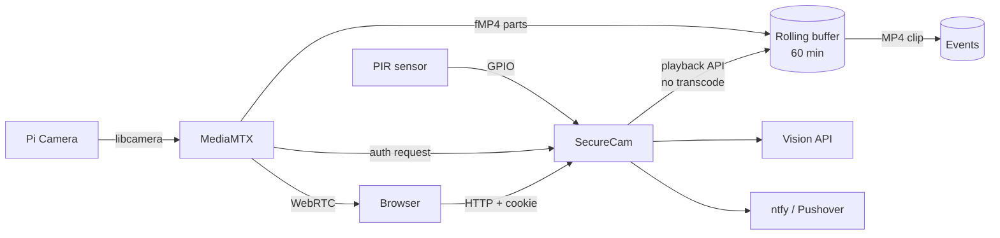

# SecureCam

An offline-first security camera for a Raspberry Pi 4. It records continuously into a short rolling buffer, and when the PIR sensor sees motion it saves a clip that **starts a minute before the trigger**. Optionally it asks an external vision model whether a person is present and sends you an alarm-grade notification.

It is deliberately small. Python never touches a video frame: [MediaMTX](https://github.com/bluenviron/mediamtx) talks to the camera directly and does the recording, and SecureCam only decides _when_ to cut a clip out of the buffer. On a Pi 4 at 1080p15 the whole system idles at a few percent CPU with no fan.

- **No cloud required.** Everything works with the network unplugged, except AI and notifications.
- **No open router ports.** Remote access is via Tailscale.
- **No frame processing in Python.** No OpenCV, no numpy, no motion algorithm.
- **Nothing to fix after installation.** `install.sh` gets you to a running, authenticated camera.

---

## Contents

- [What it does](#what-it-does)
- [Hardware](#hardware)
- [Installation](#installation)
- [First login](#first-login)
- [Configuration](#configuration)
- [The web UI](#the-web-ui)
- [Live view](#live-view)
- [Events and recordings](#events-and-recordings)
- [Notifications](#notifications)
- [AI person detection](#ai-person-detection)
- [Remote access](#remote-access)
- [Security model](#security-model)
- [Storage and retention](#storage-and-retention)
- [Diagnostics](#diagnostics)
- [Troubleshooting](#troubleshooting)
- [Command line](#command-line)
- [Updating](#updating)
- [Uninstalling](#uninstalling)
- [Architecture](#architecture)
- [Performance](#performance)
- [FAQ](#faq)
- [Contributing](#contributing)
- [License](#license)

---

## What it does

1. MediaMTX opens the Pi camera and keeps a **rolling buffer** of the last 60 minutes on disk, in one-second parts.
2. A PIR sensor on a GPIO pin is polled by SecureCam. When the line goes active and stays active past the debounce window, an **event** starts.
3. The event stays open while motion continues, and closes 5 minutes after the last motion (or at a hard 30-minute cap).
4. SecureCam then asks MediaMTX's playback API for exactly the time range of the event — including 60 seconds _before_ the trigger — and gets back an MP4. **Nothing is transcoded.**
5. A snapshot is taken, optionally sent to a vision model, and a notification is sent.
6. Old events are deleted when they get older than the retention window, or when the disk gets full.

The camera can be **armed or disarmed** from the web UI. Disarmed, live view and the rolling buffer keep running exactly as before — motion simply stops creating events, clips, AI calls and notifications. The setting is remembered across restarts and power cuts.

Everything is crash-safe: event metadata is written to disk at every state change, and an event interrupted by a power cut is recovered from the rolling buffer on the next start.

## Hardware

| Part                                    | Notes                                                            |
| --------------------------------------- | ---------------------------------------------------------------- |
| Raspberry Pi 4, 2 GB or more            | 4 GB is what this is tuned for. A Pi 5 works too.                |
| Official Pi Camera Module (v1/v2/v3/HQ) | Connected to the CSI port. USB webcams are not supported.        |
| HC-SR501 PIR sensor (or similar)        | 3 wires: VCC, GND, OUT.                                          |
| microSD card, 32 GB or more             | A-rated cards last much longer.                                  |
| 5 V 3 A USB-C power supply              | Undervoltage is the single most common cause of weird behaviour. |

Wiring, jumper settings and sensitivity tuning: **[docs/hardware.md](docs/hardware.md)**.

Quick version — PIR to the Pi's 40-pin header:

| PIR pin | Pi pin | Pi signal       |
| ------- | ------ | --------------- |
| VCC     | 2 or 4 | 5 V             |
| OUT     | 11     | GPIO17 (BCM 17) |
| GND     | 6      | Ground          |

> The PIR **OUT** line is 3.3 V on an HC-SR501 even when powered from 5 V, so it is safe on a GPIO input. If you use a different module, check this before wiring it.

## Installation

Requires **Raspberry Pi OS Lite 64-bit (Bookworm or later)**. Full walkthrough including flashing the card: **[docs/installation.md](docs/installation.md)**.

```bash
sudo apt update && sudo apt install -y git
git clone https://github.com/roypolinder/SecureCam.git
cd SecureCam
sudo ./install.sh
```

The installer:

- checks the architecture, the model, the RAM and the free disk space, and stops with an explanation if something is wrong;
- installs the apt packages (`python3-yaml`, `python3-gpiozero`, `python3-lgpio`, `ffmpeg`, ...) — nothing is pulled from PyPI;
- creates a locked-down system user `securecam`;
- downloads MediaMTX and **verifies its SHA-256** before unpacking it;
- asks which GPIO pin your PIR is on;
- generates `/etc/securecam/securecam.env` (mode 0600) with a random signing secret;
- walks you through creating the first admin account;
- installs and starts two systemd services.

Useful flags:

```bash
sudo ./install.sh --unattended --gpio 17   # no prompts
sudo ./install.sh --skip-apt               # packages already installed
sudo ./install.sh --skip-mediamtx          # air-gapped; place the binary yourself
sudo ./install.sh --mediamtx-version v1.20.1
```

Running it again is safe. It will not overwrite an existing `config.yaml`, user database, secret file, or your recordings.

## First login

The installer prints the URL at the end. It is `http://<pi-ip>:8080`.

```bash
hostname -I          # find the Pi's address
```

Log in with the admin account you created during installation. If you skipped that step:

```bash
sudo -u securecam securecam-admin user add alice --role admin
```

## Configuration

One file: `/etc/securecam/config.yaml`. Every option is documented inline in [config/config.example.yaml](config/config.example.yaml), and explained in **[docs/configuration.md](docs/configuration.md)**.

```bash
sudo nano /etc/securecam/config.yaml
sudo -u securecam securecam-admin check-config     # validate before restarting
sudo systemctl restart securecam
```

`check-config` refuses to let you start with a broken configuration and tells you exactly which key is wrong and what a valid value looks like.

Secrets are **not** in `config.yaml`. They live in `/etc/securecam/securecam.env` and the config only refers to them by environment variable name:

```bash
sudo nano /etc/securecam/securecam.env
```

```ini
SECURECAM_SECRET_KEY=...generated at install...
SECURECAM_AI_API_KEY=sk-...
SECURECAM_NTFY_TOKEN=tk_...
```

The settings most people change first:

| Key                          | Default      | What it does                                    |
| ---------------------------- | ------------ | ----------------------------------------------- |
| `device.name`                | `Front Door` | Shown in the UI and in notifications.           |
| `motion.gpio`                | `17`         | BCM pin the PIR OUT wire is on.                 |
| `motion.pre_event_seconds`   | `60`         | Seconds of video kept from before the trigger.  |
| `motion.post_motion_seconds` | `300`        | How long after the last motion an event closes. |
| `storage.retention_days`     | `7`          | How long clips are kept.                        |
| `notifications.enabled`      | `false`      | Turn on push notifications.                     |
| `ai.enabled`                 | `false`      | Turn on person detection.                       |
| `api.web_ui`                 | `true`       | Serve the browser UI.                           |

## The web UI

Four tabs, no build step, no JavaScript framework, no external requests:

- **Live** — WebRTC video, sub-second latency.
- **Events** — newest first, with a snapshot thumbnail, a person/clear badge, and inline playback.
- **Status** — every health check with its remedy, disk usage, camera state, network state, CPU temperature.
- **Users** — add, disable, delete users and change roles (admins only).

The header carries an **Armed / Disarmed** badge and, for admins, a button to switch between the two. Disarming stops motion from being recorded; it does not stop live view, the rolling buffer, or the PIR itself. Any event that is recording when you disarm is closed cleanly rather than abandoned. Viewers can see the badge but cannot change it.

Turn it off entirely with `api.web_ui: false` if you only want the JSON API.

## Live view

Live video uses **WebRTC** served by MediaMTX on port 8889. The browser asks SecureCam for a short-lived stream ticket (2 minutes by default), and MediaMTX validates that ticket with SecureCam before handing over a single frame.

For this to work, port 8889 (TCP) and 8189 (UDP) must be reachable from your browser. On a LAN that is automatic. Over Tailscale, see [remote access](#remote-access).

If live view fails, events still record — the two paths are independent by design.

## Events and recordings

Each event is a directory under `/var/lib/securecam/events/YYYY/MM/DD/event_<timestamp>_<id>/`:

```
event.json      state, timestamps, AI result, notification result, per-task retry state
recording.mp4   the clip, cut from the rolling buffer without re-encoding
snapshot.jpg    a still from a few seconds after the trigger
```

Because it is just files, `rsync`, `scp` or a Samba share are all valid backup strategies. Nothing is in a database.

The API for scripting against events is documented in **[docs/api.md](docs/api.md)**.

## Notifications

Two providers, both chosen because they can produce a notification that actually **wakes you up**:

- **[ntfy](https://ntfy.sh)** — free, self-hostable. Priority 5 bypasses Do Not Disturb on Android. `ntfy.call` can phone you (paid ntfy.sh feature).
- **[Pushover](https://pushover.net)** — one-off purchase. Priority 2 is _emergency_: it repeats until you acknowledge it and ignores quiet hours.

```yaml
notifications:
  enabled: true
  provider: ntfy
  alarm: true
  include_snapshot: true
  recipients:
    - id: my-phone
      enabled: true
      target: "some-long-unguessable-topic-name"
```

```bash
sudo -u securecam securecam-admin test-notify
```

> With ntfy, **anyone who knows the topic name can read your notifications.** Use a long random string, and set a token if you self-host. Details and per-recipient overrides: [docs/configuration.md](docs/configuration.md).

Notifications are retried with backoff for up to 24 hours if the internet is down. A failed notification never affects recording.

## AI person detection

Optional, off by default, and never required. SecureCam sends a snapshot to an OpenAI-compatible vision endpoint and asks a yes/no question about whether a person is visible.

```yaml
ai:
  enabled: true
  provider: openai_vision
  openai_vision:
    base_url: https://api.openai.com/v1
    model: gpt-4o-mini
    api_key_env: SECURECAM_AI_API_KEY
```

```bash
sudo nano /etc/securecam/securecam.env   # add SECURECAM_AI_API_KEY=sk-...
sudo systemctl restart securecam
sudo -u securecam securecam-admin test-ai
```

`base_url` works with anything that speaks the OpenAI chat-completions API, including a local Ollama or vLLM on another machine on your LAN. There is also a `generic_http` provider for arbitrary detection services.

**No image ever leaves the Pi unless you enable this.** With `ai.enabled: false` there are no outbound requests at all except the notification provider.

## Remote access

There are no router ports to forward. SecureCam uses [Tailscale](https://tailscale.com), a WireGuard mesh VPN, so the Pi is reachable from your phone anywhere without exposing anything to the internet.

```bash
sudo ./scripts/setup-remote-access.sh
```

It installs Tailscale, logs you in, adds the Tailscale IP to `mediamtx.webrtc_additional_hosts` so WebRTC works over the tunnel, sets `api.public_base_url` so notification links are clickable, and restarts the services.

Full walkthrough and the alternatives (WireGuard, reverse proxy, why not port forwarding): **[docs/remote-access.md](docs/remote-access.md)**.

## Security model

Read **[docs/security.md](docs/security.md)** before you expose this to anything.

- Passwords are hashed with **PBKDF2-HMAC-SHA256** and a per-user salt. Never stored or logged in the clear.
- Sessions are HMAC-signed tokens in an `HttpOnly`, `SameSite=Strict` cookie.
- **MediaMTX cannot serve a frame without asking SecureCam first.** Every read, playback and API action goes to a loopback-only callback that fails closed.
- **Publishing to the stream is always denied.** The camera is the only source.
- The control and playback APIs bind to `127.0.0.1` only.
- Login is rate limited per client address.
- The service runs as a dedicated non-login user under systemd hardening (`ProtectSystem`, `PrivateTmp`, `ProtectHome`, `RestrictAddressFamilies`, memory caps) and has exactly one sudo permission: restarting the MediaMTX unit.
- Secrets live in a 0600 env file owned by root, referenced by name from the config, and are redacted from all logs and API responses.
- Two roles: `viewer` (live + events) and `admin` (everything). The last admin account cannot be deleted, demoted or disabled.

**HTTP is the default.** On a LAN behind a router that is a deliberate trade-off for zero-friction setup. If you use SecureCam over an untrusted network, either use Tailscale (which encrypts everything) or enable TLS in `api.tls`.

## Storage and retention

Two things consume disk:

|                | Path                        | Bounded by                                                           |
| -------------- | --------------------------- | -------------------------------------------------------------------- |
| Rolling buffer | `/var/lib/securecam/buffer` | `storage.buffer_retain_minutes` (60 min is about 1.4 GB at 3 Mbit/s) |
| Saved events   | `/var/lib/securecam/events` | `storage.retention_days`, `max_usage_percent`, `min_free_gb`         |

The cleanup pass runs every 5 minutes. It first deletes events past the retention window, then — if the disk is still above `max_usage_percent` or below `min_free_gb` — deletes the oldest events until it is not. **An event that is currently recording is never deleted.** If it cannot free enough, it says so loudly in the log and in the health status rather than silently filling the card.

## Diagnostics

Every subsystem has a script that checks it and tells you what to do about what it finds:

```bash
sudo ./scripts/diagnose.sh            # everything
sudo ./scripts/diagnose-camera.sh     # camera detection, MediaMTX, the stream
sudo ./scripts/diagnose-pir.sh        # sensor wiring and current level
sudo ./scripts/diagnose-storage.sh    # disk, permissions, retention, buffer
sudo ./scripts/diagnose-network.sh    # link, DNS, internet, listening ports
sudo ./scripts/health-check.sh        # one-line summary, exit 0/1/2 for cron
sudo ./scripts/pir-test.py --gpio 17  # live PIR readout while you wave at it
```

The same information is available as JSON:

```bash
sudo -u securecam securecam-admin diagnose --json
```

## Troubleshooting

| Symptom                 | Start here                                                         |
| ----------------------- | ------------------------------------------------------------------ |
| Service will not start  | `sudo journalctl -u securecam -n 50`                               |
| No video                | `sudo ./scripts/diagnose-camera.sh`                                |
| No events ever          | `sudo ./scripts/pir-test.py --gpio 17`                             |
| Constant events         | Turn the PIR sensitivity pot down; raise `motion.debounce_seconds` |
| Live view spins forever | `sudo ./scripts/diagnose-network.sh`; check port 8889/8189         |
| Disk filling up         | `sudo ./scripts/diagnose-storage.sh`                               |
| No notifications        | `sudo -u securecam securecam-admin test-notify`                    |
| Locked out              | `sudo -u securecam securecam-admin user passwd <name>`             |

Every failure message in SecureCam tells you what failed, why it probably failed, whether the rest of the system still works, and the exact next command to run. The full matrix is in **[docs/troubleshooting.md](docs/troubleshooting.md)**.

## Command line

```bash
securecam-admin check-config [--show]      # validate the config
securecam-admin render-mediamtx [--stdout] # regenerate mediamtx.yml
securecam-admin device show                # device id, name, user count
securecam-admin user list
securecam-admin user add <name> [--role admin|viewer]
securecam-admin user passwd <name>
securecam-admin user role <name> <role>
securecam-admin user enable <name> --on|--off
securecam-admin user delete <name>
securecam-admin test-notify
securecam-admin test-ai [--image FILE]
securecam-admin diagnose [--json]
```

Run these as the service user so file ownership stays correct: `sudo -u securecam securecam-admin ...`

## Updating

```bash
cd SecureCam
git pull
sudo ./install.sh
```

The installer detects the existing installation, replaces the application code, and leaves your configuration, users and recordings alone. Check the release notes before a major version bump.

## Uninstalling

```bash
sudo ./uninstall.sh
```

Removes the services and the application but **keeps `/var/lib/securecam` (your recordings) and `/etc/securecam` (your configuration)**.

```bash
sudo ./uninstall.sh --purge
```

Deletes those too. It asks twice.

## Architecture



Two processes:

- `securecam-mediamtx.service` — MediaMTX. Owns the camera, the buffer, and all streaming.
- `securecam.service` — the Python control plane. Owns the PIR, the state machine, clip extraction, AI, notifications, health and the HTTP API. `Type=notify` with a 120-second watchdog, so a hung process is restarted by systemd.

Neither one can start recording without the other, and neither one dies if the other does. Design decisions and why each one was made: **[docs/architecture.md](docs/architecture.md)**.

## Performance

Measured on a Pi 4 (4 GB), 1080p15 at 3 Mbit/s, no fan, no heatsink beyond the case:

|                     | Idle      | During an event |
| ------------------- | --------- | --------------- |
| CPU                 | 3-6 %     | 8-15 %          |
| RAM (both services) | ~120 MB   | ~160 MB         |
| Disk write          | ~0.4 MB/s | ~0.4 MB/s       |
| CPU temperature     | 50-60 °C  | 55-65 °C        |

The Pi 4 throttles at 80 °C. SecureCam warns at 75 °C. If you see throttling, drop `camera.fps` to 10 or `camera.width/height` to 1280x720 — both cut the encoder load and the bitrate substantially.

## FAQ

**Does it work without internet?**
Yes. Recording, live view on the LAN, the web UI, storage management and diagnostics are all fully offline. Only AI and notifications need the internet, and both retry when it comes back.

**Can I use a USB webcam?**
Not out of the box. The MediaMTX path uses the native `rpiCamera` source. You can point it at a USB device yourself by editing the template, but that is unsupported.

**Can I run several cameras?**
Run one SecureCam per Pi. Each has its own `device.id`, and user accounts are bound to a device id, so an account for one camera cannot log into another.

**Does the AI run on the Pi?**
No. There is no TPU and no accelerator in this design, and running a detector on the CPU would cost more than the rest of the system combined. AI is an optional call to an external endpoint — which can be a machine on your own LAN.

**Why MediaMTX instead of writing the pipeline myself?**
Because pre-event recording needs a continuous buffer, and a continuous buffer plus WebRTC plus RTSP plus authentication is exactly what MediaMTX already does well, in Go, at almost no CPU cost. Duplicating it in Python would be slower and worse.

**Where are the logs?**
`sudo journalctl -u securecam -f` and `sudo journalctl -u securecam-mediamtx -f`. Set `logging.file` if you also want a rotating file.

**Is my footage sent anywhere?**
Only the single snapshot per event, and only if you enable AI. Video clips never leave the Pi.

## Contributing

Issues and pull requests are welcome.

```bash
python -m pip install -r requirements-dev.txt
python -m pytest              # unit + integration tests, no hardware needed
python -m compileall -q src
bash -n install.sh            # shell syntax check
```

The test suite runs on any machine — there are no Raspberry Pi imports at module level. Please keep it that way, keep comments to one line, and make every new error message say what to do next.

## License

MIT. See [LICENSE](LICENSE).

MediaMTX is a separate project under its own MIT license and is downloaded at install time, not vendored here.
