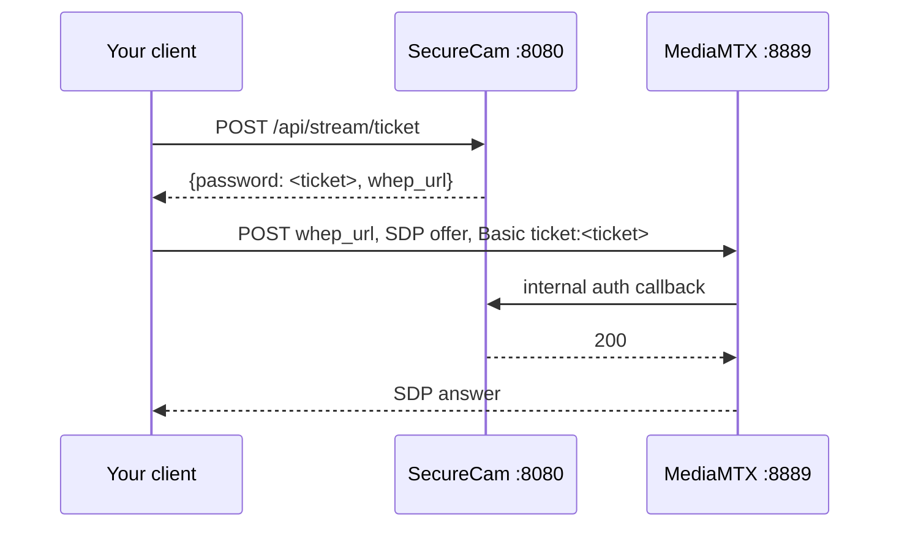

# HTTP API

Everything the web UI does, it does through this API. It is small, JSON-only, and stable.

Base URL: `http://<pi>:8080` (or your `api.public_base_url`).

- [Authentication](#authentication)
- [Errors](#errors)
- [Endpoints](#endpoints)
- [Live streaming](#live-streaming)
- [Examples](#examples)

---

## Authentication

Log in once, then send either the cookie or a bearer token.

```bash
curl -sS -X POST http://pi:8080/api/login \
  -H 'Content-Type: application/json' \
  -H 'X-Requested-With: SecureCam' \
  -d '{"username":"alice","password":"..."}'
```

```json
{
  "token": "eyJ...base64....abc123signature",
  "expires_in": 43200,
  "user": { "username": "alice", "role": "admin", "device_id": "cam-a1b2c3" }
}
```

The same token is also set as a cookie:

```
Set-Cookie: securecam_session=<token>; HttpOnly; SameSite=Strict; Path=/; Max-Age=43200
```

For scripts, use the bearer header:

```bash
curl -H "Authorization: Bearer $TOKEN" -H 'X-Requested-With: SecureCam' http://pi:8080/api/events
```

**Send `X-Requested-With: SecureCam` on every state-changing request.** It is a CSRF defence — a cross-site form post cannot set a custom header.

Tokens are HMAC-signed and carry the username, role, device id and expiry. They cannot be forged or extended, and a token issued by one camera is rejected by another.

Login is rate limited per client address: `api.rate_limit.login_attempts` per `window_seconds`. Exceeding it returns `429`.

## Errors

Every error is a JSON object with an `error` and sometimes a `hint`:

```json
{
  "error": "no video is stored for this event (recording state: failed)",
  "hint": "The rolling buffer may have expired before extraction finished."
}
```

| Status | Meaning                                                   |
| ------ | --------------------------------------------------------- |
| 400    | Bad input. The message names the problem.                 |
| 401    | Missing, expired or invalid credentials.                  |
| 403    | Authenticated, but your role does not allow this.         |
| 404    | No such route, event or user.                             |
| 405    | The path exists but not with that method.                 |
| 409    | Conflict, e.g. deleting an event that is still recording. |
| 429    | Rate limited.                                             |
| 500    | Bug. Check the journal.                                   |
| 503    | A subsystem has not started yet.                          |

## Endpoints

### Public

#### `GET /api/info`

What the login page needs before anyone is authenticated. Deliberately reveals nothing sensitive.

```json
{
  "name": "Front Door",
  "device_id": "cam-a1b2c3",
  "version": "1.0.0",
  "web_ui": true
}
```

#### `POST /api/login`

Body: `{"username": "...", "password": "..."}`. See [Authentication](#authentication).

### Session

#### `POST /api/logout`

Clears the cookie. Bearer tokens are not revoked — they expire. To invalidate everything immediately, rotate `SECURECAM_SECRET_KEY` and restart.

#### `GET /api/session`

```json
{
  "username": "alice",
  "role": "admin",
  "device_id": "cam-a1b2c3",
  "expires_at": "2024-05-01T12:00:00Z",
  "permissions": [
    "view_live",
    "view_events",
    "manage_device",
    "manage_users",
    "configure"
  ]
}
```

### Status

#### `GET /api/health` — _viewer_

Aggregated subsystem health. Each check carries a status, a human message and a **remedy**.

```json
{
  "status": "degraded",
  "checks": [
    {
      "name": "camera",
      "status": "ok",
      "message": "Streaming at 1920x1080@15",
      "remedy": ""
    },
    {
      "name": "storage",
      "status": "degraded",
      "message": "Disk 84% full",
      "remedy": "Lower storage.retention_days or move recordings to external storage."
    }
  ]
}
```

Status values: `ok`, `degraded`, `critical`, `unknown`. The overall status is the worst of the checks.

Returns `503` if health monitoring has not started yet.

#### `GET /api/diagnostics` — _admin_

The full report — the same data as `securecam-admin diagnose --json`. System, camera, storage, motion, network, services, configuration summary. Secrets are removed.

### Arming

Arming controls **recording only**. A disarmed camera still streams live, still fills the rolling buffer, and still reads the PIR — it just does not turn motion into events, clips, AI calls or notifications.

#### `GET /api/arming` — _viewer_

```json
{
  "armed": true,
  "changed_at": "2024-05-01T12:00:00Z",
  "changed_by": "alice"
}
```

#### `POST /api/arming` — _admin_

```json
{ "armed": false }
```

Returns the same shape as `GET`. Disarming finalizes any event that is currently recording with `finalize_reason: "disarmed"`, so nothing is left half-written. The state is persisted to `/var/lib/securecam/arm-state.json` and survives restarts and power cuts. `400` if `armed` is not a boolean.

### Events

#### `GET /api/events` — _viewer_

| Query    | Default | Notes                                                 |
| -------- | ------- | ----------------------------------------------------- |
| `limit`  | 50      | 1-200                                                 |
| `offset` | 0       | For paging                                            |
| `status` | all     | `recording`, `completed`, `interrupted`, `failed`     |
| `person` |         | `true` returns only events where AI detected a person |

```json
{
  "events": [
    {
      "event_id": "event_20240501_120000_a1b2c3d4",
      "device_name": "Front Door",
      "started_at": "2024-05-01T12:00:00Z",
      "ended_at": "2024-05-01T12:03:20Z",
      "duration_seconds": 200,
      "status": "completed",
      "trigger": "pir",
      "person_detected": true,
      "confidence": 0.94,
      "has_video": true,
      "has_snapshot": true
    }
  ],
  "limit": 50,
  "offset": 0
}
```

#### `GET /api/events/{event_id}` — _viewer_

Full metadata, including the per-task state for recording, AI and notification: attempt count, last error, next retry time. This is the same JSON stored in the event directory.

#### `GET /api/events/{event_id}/snapshot` — _viewer_

`image/jpeg`. Optional `?file=` to pick one of several snapshots. `404` if none was saved.

#### `GET /api/events/{event_id}/video` — _viewer_

`video/mp4` with byte-range support so browsers can seek without downloading the whole clip.

`404` if the clip is missing, with a hint naming the recording task's state and last error.

#### `DELETE /api/events/{event_id}` — _admin_

`409` if the event is still recording.

### Live stream

#### `POST /api/stream/ticket` — _viewer_

Issues a short-lived credential for the WebRTC handshake.

```json
{
  "username": "ticket",
  "password": "eyJ...",
  "expires_in": 120,
  "whep_url": "http://pi:8889/cam/whep",
  "path": "cam"
}
```

The `whep_url` host is derived from the `Host` header you used, so the URL works on the LAN and over Tailscale alike.

### Configuration and users

#### `GET /api/config` — _admin_

The running configuration with every secret-bearing field removed. Read-only; there is no API to change the config, deliberately. Edit `/etc/securecam/config.yaml` and restart.

#### `GET /api/users` — _admin_

```json
{
  "users": [
    {
      "username": "alice",
      "role": "admin",
      "enabled": true,
      "created_at": "2024-04-01T09:00:00Z",
      "last_login_at": "2024-05-01T08:12:00Z"
    }
  ]
}
```

Password hashes are never returned.

#### `POST /api/users` — _admin_

Body: `{"username": "bob", "password": "...", "role": "viewer"}`. Returns `201`.

Usernames must be alphanumeric with `-` and `_`. Passwords must be at least 12 characters.

#### `PATCH /api/users/{username}` — _admin_

Any combination of `password`, `role`, `enabled`.

```json
{ "role": "admin" }
```

`400` if the change would remove, demote or disable the **last admin**.

#### `DELETE /api/users/{username}` — _admin_

`400` for the last admin.

### Web UI

Served only when `api.web_ui: true`:

- `GET /` — the single-page app.
- `GET /static/{name}` — `app.js`, `style.css`.

## Live streaming

Live view is WebRTC via [WHEP](https://www.ietf.org/archive/id/draft-murillo-whep-03.html), served by MediaMTX on port 8889 — not by this API.



Minimal browser implementation:

```js
const t = await (
  await fetch("/api/stream/ticket", {
    method: "POST",
    headers: { "X-Requested-With": "SecureCam" },
    credentials: "same-origin",
  })
).json();

const pc = new RTCPeerConnection();
pc.addTransceiver("video", { direction: "recvonly" });
pc.addTransceiver("audio", { direction: "recvonly" });
pc.ontrack = (e) => {
  document.querySelector("video").srcObject = e.streams[0];
};

await pc.setLocalDescription(await pc.createOffer());
await new Promise((r) => {
  if (pc.iceGatheringState === "complete") return r();
  pc.onicegatheringstatechange = () =>
    pc.iceGatheringState === "complete" && r();
  setTimeout(r, 3000);
});

const answer = await fetch(t.whep_url, {
  method: "POST",
  headers: {
    "Content-Type": "application/sdp",
    Authorization: "Basic " + btoa("ticket:" + t.password),
  },
  body: pc.localDescription.sdp,
});
await pc.setRemoteDescription({ type: "answer", sdp: await answer.text() });
```

Ports 8889/tcp and 8189/udp must be reachable from the client.

## Examples

**Log in and keep the token**

```bash
TOKEN=$(curl -sS -X POST http://pi:8080/api/login \
  -H 'Content-Type: application/json' -H 'X-Requested-With: SecureCam' \
  -d '{"username":"alice","password":"'"$PASS"'"}' | jq -r .token)
```

**Download every clip where a person was detected today**

```bash
curl -sS -H "Authorization: Bearer $TOKEN" -H 'X-Requested-With: SecureCam' \
  'http://pi:8080/api/events?person=true&limit=200' \
| jq -r '.events[] | select(.has_video) | .event_id' \
| while read -r id; do
    curl -sS -H "Authorization: Bearer $TOKEN" -H 'X-Requested-With: SecureCam' \
      -o "$id.mp4" "http://pi:8080/api/events/$id/video"
  done
```

**Nagios-style health check**

```bash
status=$(curl -sS -H "Authorization: Bearer $TOKEN" -H 'X-Requested-With: SecureCam' \
  http://pi:8080/api/health | jq -r .status)
case "$status" in
  ok) exit 0 ;;
  degraded) exit 1 ;;
  *) exit 2 ;;
esac
```

**Home Assistant sensor**

```yaml
rest:
  - resource: http://pi:8080/api/health
    headers:
      Authorization: !secret securecam_token
      X-Requested-With: SecureCam
    scan_interval: 60
    sensor:
      - name: "Front Door Camera Health"
        value_template: "{{ value_json.status }}"
```

**Add a viewer account**

```bash
curl -sS -X POST http://pi:8080/api/users \
  -H "Authorization: Bearer $TOKEN" \
  -H 'Content-Type: application/json' -H 'X-Requested-With: SecureCam' \
  -d '{"username":"guest","password":"a-long-enough-password","role":"viewer"}'
```

> A long-lived bearer token in a script is a long-lived credential. Store it with the same care as a password, give the account the `viewer` role, and shorten `api.session_ttl_hours` if you are uncomfortable with 12 hours.
