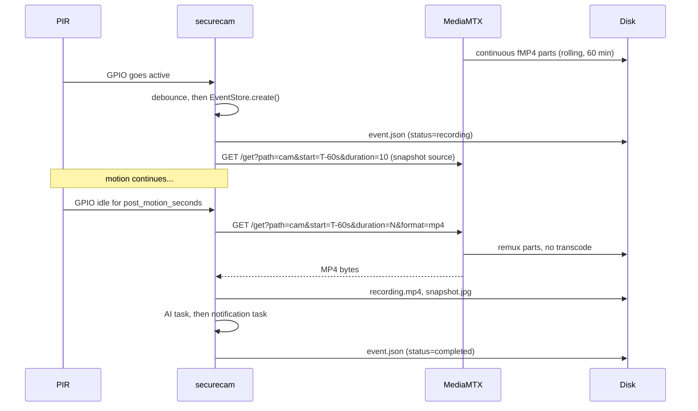
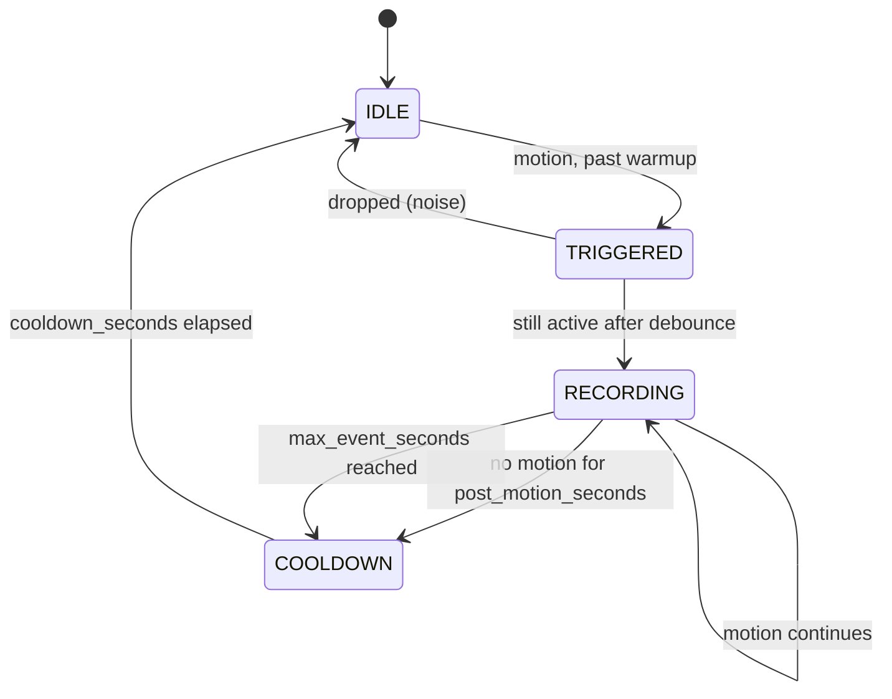
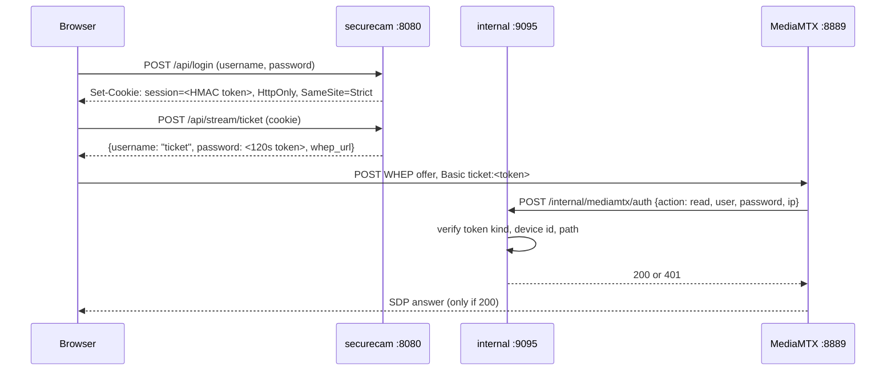

# Architecture

Why SecureCam is built the way it is, and what would break if you changed it.

- [The core idea](#the-core-idea)
- [Processes](#processes)
- [Data flow](#data-flow)
- [Modules](#modules)
- [The motion state machine](#the-motion-state-machine)
- [Event lifecycle and durability](#event-lifecycle-and-durability)
- [Authentication flow](#authentication-flow)
- [Failure isolation](#failure-isolation)
- [Design decisions](#design-decisions)
- [What is deliberately missing](#what-is-deliberately-missing)

---

## The core idea

A security camera has one hard requirement that a naive design cannot meet: **the interesting part happened before the sensor fired.** By the time a PIR detects someone, they have already walked into frame.

The only way to record the past is to always be recording. So:

1. MediaMTX records the camera continuously into a rolling buffer of fMP4 parts.
2. The buffer is bounded — 60 minutes by default — so it costs a fixed amount of disk.
3. When something happens, SecureCam asks MediaMTX for a **time range** out of that buffer.

That is the whole system. Everything else is plumbing around it.

The consequence: **Python never sees a video frame.** No decoding, no encoding, no `numpy`, no `OpenCV`, no per-frame anything. Clip extraction is one HTTP request that returns an MP4 remuxed from parts that already exist on disk. This is why a fanless Pi 4 idles at a few percent CPU.

## Processes

```
systemd
 ├── securecam-mediamtx.service        Go, ~80 MB RSS
 │     owns: camera, rolling buffer, RTSP/HLS/WebRTC, playback API
 │
 └── securecam.service                 Python 3.11, ~40 MB RSS
       owns: PIR, state machine, clip extraction, AI, notifications,
             health, storage cleanup, HTTP API, web UI
```

They are separate units on purpose:

- MediaMTX restarting does not lose an in-flight event; SecureCam re-queries the buffer.
- SecureCam restarting does not interrupt recording; the buffer keeps filling.
- Each has its own `MemoryMax`, so a leak in one cannot take down the Pi.
- MediaMTX runs at `Nice=-5` because dropped frames are unrecoverable, while a delayed notification is not.

`securecam.service` is `Type=notify` with `WatchdogSec=120`. The main loop pings the watchdog every tick, so a hung process is killed and restarted by systemd rather than silently ceasing to record.

The only privileged interaction is one sudoers line allowing `systemctl restart securecam-mediamtx.service` — needed when a config change requires regenerating `mediamtx.yml`. Nothing else.

## Data flow



## Modules

| Module                  | Responsibility                                                                                                                             |
| ----------------------- | ------------------------------------------------------------------------------------------------------------------------------------------ |
| `main.py`               | The `Controller`. Wires every subsystem together, owns the tick loop, handles startup, shutdown and the systemd watchdog.                  |
| `config.py`             | Parses and **validates** YAML into typed dataclasses. Cross-checks that combinations make sense. Refuses to produce a half-valid `Config`. |
| `pir.py`                | Polls the GPIO with gpiozero. Debounce, warmup, minimum-active. Exposes `poll_once()` so it is testable without hardware.                  |
| `statemachine.py`       | `IDLE -> TRIGGERED -> RECORDING -> COOLDOWN`. Pure logic on an injected clock — no I/O, no threads.                                        |
| `events.py`             | `Event`, `TaskInfo`, `EventStore`. All persistence of event metadata.                                                                      |
| `mediamtx.py`           | Renders `mediamtx.yml` from the template, supervises the unit, and wraps the control and playback APIs.                                    |
| `recorder.py`           | Turns a time range into an MP4 via the playback API.                                                                                       |
| `snapshot.py`           | One ffmpeg invocation against the RTSP stream to get a JPEG. The only place ffmpeg is used.                                                |
| `storage.py`            | Directory preparation, disk status, retention, over-limit cleanup, interrupted-event recovery.                                             |
| `pipeline.py`           | Everything that happens _after_ an event closes: snapshot, AI, notification, with per-task retry state.                                    |
| `worker.py`             | `TaskRunner` (a small thread pool) and `PendingWorker` (rescans disk for due retries).                                                     |
| `networking.py`         | TCP-connect probes for link, DNS and internet. Notifies subscribers on change so retries fire immediately.                                 |
| `health.py`             | Aggregates named `Check`s, each with a status, a message and a **remedy**.                                                                 |
| `diagnostics.py`        | Structured system report shared by the CLI and `GET /api/diagnostics`.                                                                     |
| `auth/`                 | `TokenSigner` (HMAC tokens), `UserStore` (PBKDF2 password hashing, roles, device binding).                                                 |
| `api/`                  | A small threaded HTTP server, a regex router, the route handlers, and the static web UI.                                                   |
| `ai/`, `notifications/` | Pluggable providers behind a common interface, selected by name.                                                                           |

No module imports `gpiozero` at import time except `pir.py`, and that import is deferred — which is why the whole test suite runs on a Windows laptop.

## The motion state machine



It is a pure function of `(current state, sensor level, current time)`. It performs no I/O and takes its clock as a parameter, so all seven of its behaviours are unit-tested deterministically with a fake clock.

The controller ticks it four times a second. That is far faster than a PIR can respond and costs nothing measurable.

## Event lifecycle and durability

`event.json` is written at **every** state change, not at the end. An event therefore always has an on-disk state:

| Status        | Meaning                                                                                        |
| ------------- | ---------------------------------------------------------------------------------------------- |
| `recording`   | Open. Never deleted by cleanup.                                                                |
| `completed`   | Finished, video extracted.                                                                     |
| `interrupted` | The process died while it was open. Recovered on next start if the buffer still has the video. |
| `failed`      | Extraction failed permanently.                                                                 |

Each of AI, notification and recording is a `TaskInfo` with its own state, attempt count, last error and next-retry time. That means:

- A restart mid-event loses nothing but the open range, which is re-derived from the buffer.
- A failed notification is retried from disk by `PendingWorker` for up to 24 hours, across restarts.
- Nothing is held only in memory, and there is no database to corrupt.

Metadata that cannot be parsed is **skipped, not fatal** — one bad directory never takes down the event list.

## Authentication flow

MediaMTX is configured with `authMethod: http`, pointing at a plain-HTTP loopback-only listener inside SecureCam.



Properties this buys:

- **MediaMTX cannot serve a frame without SecureCam's approval.** Any non-2xx denies.
- The listener is separate from the public API so that enabling TLS on 8080 does not break the callback, which must stay plain HTTP on loopback.
- It **fails closed** for viewing. If SecureCam is down, nobody can watch — but MediaMTX keeps recording, so nothing is lost.
- `publish` is denied unconditionally. The camera is the only source, so nobody can inject a fake stream.
- Control-API and playback actions additionally require the source address to be loopback.

## Failure isolation

The rule is: **losing video is unacceptable, losing anything else is survivable.**

| If this fails               | Then                                                                                                 |
| --------------------------- | ---------------------------------------------------------------------------------------------------- |
| Internet                    | Recording, live view, UI all continue. AI and notifications queue and retry.                         |
| AI endpoint                 | Event keeps its video and snapshot. Notification is still sent (fail open).                          |
| Notification provider       | Retried with backoff for 24 hours, across restarts.                                                  |
| MediaMTX                    | Supervisor detects it and restarts the unit. In-flight event is recovered.                           |
| SecureCam                   | systemd restarts it. MediaMTX kept recording throughout. Interrupted events are recovered.           |
| Disk full                   | Oldest events deleted. Active event never deleted. If it still cannot free space, it says so loudly. |
| PIR sensor                  | Live view and buffer unaffected. Health reports it.                                                  |
| Config edit that is invalid | Service refuses to start with a precise message, instead of starting misconfigured.                  |

## Design decisions

**MediaMTX instead of a hand-written pipeline.** Pre-event recording needs a continuous buffer; a buffer plus WebRTC plus RTSP plus HLS plus an auth hook is exactly what MediaMTX already is, in Go, at near-zero CPU. Reimplementing that in Python would be slower, buggier and larger.

**`source: rpiCamera` instead of piping `rpicam-vid`.** No subprocess to supervise, no pipe to stall, no restart storm when the camera hiccups. MediaMTX drives libcamera directly.

**PIR instead of software motion detection.** Frame-differencing on a Pi 4 CPU costs more than everything else here combined, and false-triggers on shadows, headlights and rain. A $2 sensor detects body heat, uses no CPU, and works in complete darkness.

**External AI instead of on-device.** There is no TPU in this design. Running a detector on the CPU would blow the thermal budget on a fanless Pi. AI is optional, external, and can point at a machine on your own LAN if you do not want to use a cloud API.

**Files instead of a database.** Events are directories with a JSON file, an MP4 and a JPEG. That means `rsync` is a valid backup tool, there is nothing to corrupt on a power cut, and you can read an event's history with `cat`.

**Only PyYAML from PyPI, everything else from apt.** `gpiozero` and `lgpio` are installed as Debian packages and the venv is created with `--system-site-packages`. Fewer moving parts, no compiler needed, and updates come from the distribution.

**A tiny HTTP server instead of Flask/FastAPI.** The API is ~20 routes with no ORM and no templating. `http.server` plus a 60-line router is smaller, has no dependencies, and starts instantly.

**Vanilla JavaScript instead of a framework.** No build step, no `node_modules`, no supply chain, and the UI is three static files you can read.

**Config validated up front, service refuses to start when it is wrong.** A camera that silently runs with half a configuration is worse than one that clearly does not run.

**Every error message says what to do next.** Spec-level requirement, applied to all Python log messages and shell script output.

## What is deliberately missing

| Not here                 | Why                                                                                             |
| ------------------------ | ----------------------------------------------------------------------------------------------- |
| Face recognition         | Legally fraught in many places, and needs hardware this design does not have.                   |
| Object tracking / zones  | Needs frame processing. See the core idea.                                                      |
| Two-way audio            | Different problem, different hardware.                                                          |
| Cloud storage sync       | `rsync` in a cron job already does this.                                                        |
| Multi-camera aggregation | One camera per Pi. Use Home Assistant or Frigate if you need a wall of them.                    |
| A mobile app             | The web UI is responsive and installable as a PWA-style shortcut.                               |
| Scheduling               | systemd timers already do this better.                                                          |
| Auto-update              | Unattended code changes on a security device is a bad default. `git pull && sudo ./install.sh`. |
